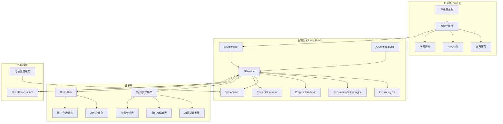
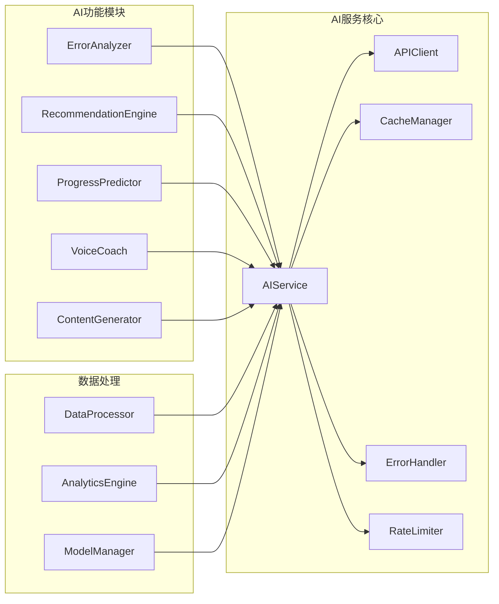

# AI集成功能技术设计文档

## 概述

本文档定义了在现有英语打字学习平台中集成AI功能的技术设计。该设计基于已完成的需求分析，旨在通过OpenRouter.ai API集成智能纠错、个性化推荐、学习预测、语音指导和内容生成等AI能力，提升用户学习体验。

设计遵循现有Spring Boot + Vue.js架构，确保与当前系统的无缝集成，并支持渐进式实施。

## 架构

### 系统整体架构



### AI服务模块架构



## 组件和接口

### 后端核心组件

#### AIService (主服务类)
```java
@Service
public class AIService {
    private final OpenRouterClient openRouterClient;
    private final RedisTemplate<String, String> redisTemplate;
    private final AIConfigService configService;
    
    // 统一AI请求处理
    public <T> CompletableFuture<T> processAIRequest(AIRequest request, Class<T> responseType);
    
    // 错误分析
    public CompletableFuture<ErrorAnalysisResponse> analyzeErrors(ErrorAnalysisRequest request);
    
    // 个性化推荐
    public CompletableFuture<RecommendationResponse> generateRecommendations(RecommendationRequest request);
    
    // 进度预测
    public CompletableFuture<ProgressPredictionResponse> predictProgress(ProgressPredictionRequest request);
    
    // 内容生成
    public CompletableFuture<ContentGenerationResponse> generateContent(ContentGenerationRequest request);
}
```

#### AIController (REST API控制器)
```java
@RestController
@RequestMapping("/api/ai")
@RequiredArgsConstructor
public class AIController {
    private final AIService aiService;
    
    @PostMapping("/analyze-errors")
    public ResponseEntity<ErrorAnalysisResponse> analyzeErrors(@RequestBody ErrorAnalysisRequest request);
    
    @PostMapping("/recommendations")
    public ResponseEntity<RecommendationResponse> getRecommendations(@RequestBody RecommendationRequest request);
    
    @PostMapping("/predict-progress")
    public ResponseEntity<ProgressPredictionResponse> predictProgress(@RequestBody ProgressPredictionRequest request);
    
    @PostMapping("/generate-content")
    public ResponseEntity<ContentGenerationResponse> generateContent(@RequestBody ContentGenerationRequest request);
    
    @GetMapping("/settings")
    public ResponseEntity<AISettingsDto> getUserAISettings();
    
    @PutMapping("/settings")
    public ResponseEntity<Void> updateAISettings(@RequestBody UpdateAISettingsRequest request);
}
```

#### OpenRouterClient (API客户端)
```java
@Component
public class OpenRouterClient {
    private final WebClient webClient;
    private final AIConfigService configService;
    
    public <T> Mono<T> sendRequest(String endpoint, Object payload, Class<T> responseType);
    
    public Mono<ErrorAnalysisResponse> analyzeErrors(String errorData);
    
    public Mono<RecommendationResponse> getRecommendations(String userData);
    
    public Mono<ProgressPredictionResponse> predictProgress(String progressData);
    
    public Mono<ContentGenerationResponse> generateContent(String contentRequest);
}
```

### 前端核心组件

#### AI助手组件 (AIAssistant.vue)
```vue
<template>
  <div class="ai-assistant">
    <!-- 实时错误提示 -->
    <div v-if="showErrorTips && currentError" class="error-tip">
      {{ currentError.suggestion }}
    </div>
    
    <!-- 语音教练 -->
    <div v-if="voiceEnabled" class="voice-coach">
      <button @click="toggleVoice">{{ voiceActive ? '🔊' : '🔇' }}</button>
    </div>
    
    <!-- AI推荐 -->
    <div v-if="recommendations.length > 0" class="recommendations">
      <h3>为你推荐</h3>
      <div v-for="rec in recommendations" :key="rec.id" class="recommendation-item">
        {{ rec.title }}
      </div>
    </div>
  </div>
</template>

<script setup lang="ts">
import { ref, onMounted } from 'vue'
import { useAIStore } from '@/stores/ai'

const aiStore = useAIStore()
const showErrorTips = ref(true)
const voiceEnabled = ref(false)
const voiceActive = ref(false)
const currentError = ref(null)
const recommendations = ref([])

// AI功能初始化
onMounted(async () => {
  await aiStore.loadUserSettings()
  showErrorTips.value = aiStore.settings.errorTipsEnabled
  voiceEnabled.value = aiStore.settings.voiceCoachEnabled
})
</script>
```

#### AI设置面板 (AISettings.vue)
```vue
<template>
  <div class="ai-settings">
    <h2>AI功能设置</h2>
    
    <!-- 智能纠错设置 -->
    <div class="setting-group">
      <h3>智能纠错</h3>
      <label>
        <input type="checkbox" v-model="settings.errorAnalysisEnabled">
        启用实时错误分析
      </label>
      <label>
        <input type="checkbox" v-model="settings.errorTipsEnabled">
        显示即时纠错建议
      </label>
    </div>
    
    <!-- 个性化推荐设置 -->
    <div class="setting-group">
      <h3>个性化推荐</h3>
      <label>
        <input type="checkbox" v-model="settings.recommendationsEnabled">
        启用个性化推荐
      </label>
      <select v-model="settings.recommendationFrequency">
        <option value="high">高频推荐</option>
        <option value="medium">中频推荐</option>
        <option value="low">低频推荐</option>
      </select>
    </div>
    
    <!-- 语音教练设置 -->
    <div class="setting-group">
      <h3>语音教练</h3>
      <label>
        <input type="checkbox" v-model="settings.voiceCoachEnabled">
        启用语音指导
      </label>
      <select v-model="settings.voiceStyle">
        <option value="encouraging">鼓励型</option>
        <option value="professional">专业型</option>
        <option value="friendly">友好型</option>
      </select>
    </div>
    
    <button @click="saveSettings">保存设置</button>
  </div>
</template>
```

## 数据模型

### AI分析数据表 (ai_analysis_data)
```sql
CREATE TABLE ai_analysis_data (
    id BIGINT PRIMARY KEY AUTO_INCREMENT,
    user_id VARCHAR(255) NOT NULL,
    session_id VARCHAR(255) NOT NULL,
    analysis_type ENUM('ERROR', 'RECOMMENDATION', 'PROGRESS', 'CONTENT') NOT NULL,
    input_data JSON NOT NULL,
    ai_response JSON NOT NULL,
    processing_time_ms INT NOT NULL,
    created_at TIMESTAMP DEFAULT CURRENT_TIMESTAMP,
    INDEX idx_user_id (user_id),
    INDEX idx_session_id (session_id),
    INDEX idx_analysis_type (analysis_type),
    INDEX idx_created_at (created_at)
);
```

### 用户AI偏好表 (user_ai_preferences)
```sql
CREATE TABLE user_ai_preferences (
    id BIGINT PRIMARY KEY AUTO_INCREMENT,
    user_id VARCHAR(255) NOT NULL UNIQUE,
    error_analysis_enabled BOOLEAN DEFAULT TRUE,
    error_tips_enabled BOOLEAN DEFAULT TRUE,
    recommendations_enabled BOOLEAN DEFAULT TRUE,
    recommendation_frequency ENUM('HIGH', 'MEDIUM', 'LOW') DEFAULT 'MEDIUM',
    voice_coach_enabled BOOLEAN DEFAULT FALSE,
    voice_style ENUM('ENCOURAGING', 'PROFESSIONAL', 'FRIENDLY') DEFAULT 'ENCOURAGING',
    progress_prediction_enabled BOOLEAN DEFAULT TRUE,
    content_generation_enabled BOOLEAN DEFAULT TRUE,
    data_sharing_consent BOOLEAN DEFAULT FALSE,
    updated_at TIMESTAMP DEFAULT CURRENT_TIMESTAMP ON UPDATE CURRENT_TIMESTAMP,
    INDEX idx_user_id (user_id)
);
```

### 错误模式分析表 (error_pattern_analysis)
```sql
CREATE TABLE error_pattern_analysis (
    id BIGINT PRIMARY KEY AUTO_INCREMENT,
    user_id VARCHAR(255) NOT NULL,
    error_type ENUM('LETTER_CONFUSION', 'FINGER_POSITION', 'RHYTHM', 'SPEED', 'ACCURACY') NOT NULL,
    error_pattern VARCHAR(500) NOT NULL,
    frequency INT DEFAULT 1,
    improvement_suggestion TEXT,
    first_occurrence TIMESTAMP DEFAULT CURRENT_TIMESTAMP,
    last_occurrence TIMESTAMP DEFAULT CURRENT_TIMESTAMP ON UPDATE CURRENT_TIMESTAMP,
    INDEX idx_user_id (user_id),
    INDEX idx_error_type (error_type),
    UNIQUE KEY unique_user_pattern (user_id, error_type, error_pattern)
);
```

### 学习分析数据表 (learning_analytics)
```sql
CREATE TABLE learning_analytics (
    id BIGINT PRIMARY KEY AUTO_INCREMENT,
    user_id VARCHAR(255) NOT NULL,
    analysis_date DATE NOT NULL,
    typing_speed_wpm DECIMAL(5,2),
    accuracy_percentage DECIMAL(5,2),
    practice_time_minutes INT,
    exercises_completed INT,
    errors_count INT,
    improvement_rate DECIMAL(5,2),
    predicted_next_speed DECIMAL(5,2),
    predicted_next_accuracy DECIMAL(5,2),
    learning_trend ENUM('IMPROVING', 'STABLE', 'DECLINING') DEFAULT 'STABLE',
    created_at TIMESTAMP DEFAULT CURRENT_TIMESTAMP,
    INDEX idx_user_id (user_id),
    INDEX idx_analysis_date (analysis_date),
    UNIQUE KEY unique_user_date (user_id, analysis_date)
);
```

## API设计

### OpenRouter.ai集成接口

#### 错误分析API
```http
POST /api/ai/analyze-errors
Content-Type: application/json
Authorization: Bearer {jwt_token}

{
  "sessionId": "session_123",
  "typingData": {
    "originalText": "Hello world",
    "userInput": "Helo wrold",
    "timestamp": "2024-01-01T10:00:00Z",
    "keystrokes": [...]
  },
  "userContext": {
    "skillLevel": "INTERMEDIATE",
    "weakAreas": ["letter_confusion", "speed"]
  }
}
```

#### 个性化推荐API
```http
POST /api/ai/recommendations
Content-Type: application/json
Authorization: Bearer {jwt_token}

{
  "userId": "user_123",
  "currentLevel": "INTERMEDIATE",
  "recentPerformance": {
    "averageSpeed": 45.5,
    "averageAccuracy": 92.3,
    "weakAreas": ["punctuation", "numbers"]
  },
  "learningGoals": {
    "targetSpeed": 60,
    "targetAccuracy": 95,
    "timeframe": "30_DAYS"
  }
}
```

#### 进度预测API
```http
POST /api/ai/predict-progress
Content-Type: application/json
Authorization: Bearer {jwt_token}

{
  "userId": "user_123",
  "historicalData": {
    "practiceHistory": [...],
    "performanceMetrics": [...],
    "learningPattern": "CONSISTENT"
  },
  "predictionPeriod": "30_DAYS"
}
```

#### 内容生成API
```http
POST /api/ai/generate-content
Content-Type: application/json
Authorization: Bearer {jwt_token}

{
  "contentType": "PRACTICE_TEXT",
  "difficulty": "INTERMEDIATE",
  "focusAreas": ["punctuation", "capitalization"],
  "length": "MEDIUM",
  "theme": "technology",
  "userPreferences": {
    "avoidWords": ["difficult_word1", "difficult_word2"],
    "preferredTopics": ["science", "technology"]
  }
}
```

### 内部API接口

#### AI设置管理
```http
GET /api/ai/settings
Authorization: Bearer {jwt_token}

Response:
{
  "errorAnalysisEnabled": true,
  "errorTipsEnabled": true,
  "recommendationsEnabled": true,
  "recommendationFrequency": "MEDIUM",
  "voiceCoachEnabled": false,
  "voiceStyle": "ENCOURAGING",
  "progressPredictionEnabled": true,
  "contentGenerationEnabled": true,
  "dataSharingConsent": false
}
```

#### 学习分析报告
```http
GET /api/ai/analytics/report?period=WEEKLY
Authorization: Bearer {jwt_token}

Response:
{
  "period": "WEEKLY",
  "startDate": "2024-01-01",
  "endDate": "2024-01-07",
  "summary": {
    "totalPracticeTime": 180,
    "averageSpeed": 48.5,
    "averageAccuracy": 93.2,
    "improvementRate": 5.2
  },
  "insights": [
    {
      "type": "STRENGTH",
      "message": "你在字母准确性方面表现优秀"
    },
    {
      "type": "IMPROVEMENT",
      "message": "建议加强数字输入练习"
    }
  ],
  "predictions": {
    "nextWeekSpeed": 52.1,
    "nextWeekAccuracy": 94.5,
    "goalAchievementDate": "2024-02-15"
  }
}
```

## 安全和隐私设计

### API密钥管理
```java
@Configuration
public class AISecurityConfig {
    
    @Value("${openrouter.api.key}")
    private String openRouterApiKey;
    
    @Bean
    public WebClient openRouterWebClient() {
        return WebClient.builder()
            .baseUrl("https://openrouter.ai/api/v1")
            .defaultHeader("Authorization", "Bearer " + openRouterApiKey)
            .defaultHeader("HTTP-Referer", "https://your-domain.com")
            .defaultHeader("X-Title", "English Typing Learning Platform")
            .build();
    }
}
```

### 数据隐私保护
```java
@Service
public class AIPrivacyService {
    
    // 数据脱敏处理
    public String anonymizeUserData(String userData) {
        // 移除个人身份信息
        // 保留学习相关数据
        return processedData;
    }
    
    // 数据加密存储
    public void encryptAndStore(String data, String userId) {
        String encryptedData = encryptionService.encrypt(data);
        // 存储加密数据
    }
    
    // 数据删除
    public void deleteUserAIData(String userId) {
        // 删除所有AI相关数据
        aiAnalysisRepository.deleteByUserId(userId);
        errorPatternRepository.deleteByUserId(userId);
        learningAnalyticsRepository.deleteByUserId(userId);
    }
}
```

### 请求限流和成本控制
```java
@Component
public class AIRateLimiter {
    
    private final RedisTemplate<String, String> redisTemplate;
    
    @Value("${ai.rate-limit.requests-per-minute:60}")
    private int requestsPerMinute;
    
    @Value("${ai.cost-limit.daily-usd:10.0}")
    private double dailyCostLimit;
    
    public boolean isRequestAllowed(String userId) {
        String key = "ai_rate_limit:" + userId;
        String count = redisTemplate.opsForValue().get(key);
        
        if (count == null) {
            redisTemplate.opsForValue().set(key, "1", Duration.ofMinutes(1));
            return true;
        }
        
        int currentCount = Integer.parseInt(count);
        if (currentCount >= requestsPerMinute) {
            return false;
        }
        
        redisTemplate.opsForValue().increment(key);
        return true;
    }
    
    public boolean isCostLimitExceeded() {
        String todayCost = redisTemplate.opsForValue().get("ai_daily_cost:" + LocalDate.now());
        if (todayCost == null) return false;
        
        return Double.parseDouble(todayCost) >= dailyCostLimit;
    }
}
```

## 性能优化设计

### 缓存策略
```java
@Service
public class AICacheService {
    
    private final RedisTemplate<String, String> redisTemplate;
    
    // 缓存AI响应
    public void cacheAIResponse(String requestHash, Object response, Duration ttl) {
        String key = "ai_response:" + requestHash;
        String jsonResponse = objectMapper.writeValueAsString(response);
        redisTemplate.opsForValue().set(key, jsonResponse, ttl);
    }
    
    // 获取缓存的响应
    public <T> Optional<T> getCachedResponse(String requestHash, Class<T> responseType) {
        String key = "ai_response:" + requestHash;
        String cachedResponse = redisTemplate.opsForValue().get(key);
        
        if (cachedResponse != null) {
            return Optional.of(objectMapper.readValue(cachedResponse, responseType));
        }
        
        return Optional.empty();
    }
    
    // 缓存用户会话数据
    public void cacheUserSession(String sessionId, UserSessionData sessionData) {
        String key = "user_session:" + sessionId;
        redisTemplate.opsForValue().set(key, 
            objectMapper.writeValueAsString(sessionData), 
            Duration.ofHours(2));
    }
}
```

### 异步处理机制
```java
@Service
public class AsyncAIService {
    
    @Async("aiTaskExecutor")
    public CompletableFuture<ErrorAnalysisResponse> analyzeErrorsAsync(ErrorAnalysisRequest request) {
        try {
            // 执行AI分析
            ErrorAnalysisResponse response = performErrorAnalysis(request);
            
            // 异步保存分析结果
            saveAnalysisResult(request.getUserId(), response);
            
            return CompletableFuture.completedFuture(response);
        } catch (Exception e) {
            return CompletableFuture.failedFuture(e);
        }
    }
    
    @Bean("aiTaskExecutor")
    public TaskExecutor aiTaskExecutor() {
        ThreadPoolTaskExecutor executor = new ThreadPoolTaskExecutor();
        executor.setCorePoolSize(5);
        executor.setMaxPoolSize(20);
        executor.setQueueCapacity(100);
        executor.setThreadNamePrefix("AI-Task-");
        executor.initialize();
        return executor;
    }
}
```

### 离线模式支持
```java
@Service
public class OfflineAIService {
    
    // 基础错误分析（离线模式）
    public ErrorAnalysisResponse analyzeErrorsOffline(ErrorAnalysisRequest request) {
        // 使用本地规则进行基础错误分析
        List<String> commonErrors = detectCommonErrors(request.getTypingData());
        List<String> suggestions = generateBasicSuggestions(commonErrors);
        
        return ErrorAnalysisResponse.builder()
            .errors(commonErrors)
            .suggestions(suggestions)
            .isOfflineMode(true)
            .build();
    }
    
    // 基础推荐（离线模式）
    public RecommendationResponse generateOfflineRecommendations(RecommendationRequest request) {
        // 基于用户历史数据的简单推荐算法
        List<Exercise> recommendations = simpleRecommendationAlgorithm(request);
        
        return RecommendationResponse.builder()
            .recommendations(recommendations)
            .isOfflineMode(true)
            .build();
    }
}
```

## 错误处理

### AI服务降级策略
```java
@Component
public class AIFallbackService {
    
    @Retryable(value = {Exception.class}, maxAttempts = 3, backoff = @Backoff(delay = 1000))
    public <T> T executeWithRetry(Supplier<T> aiOperation) {
        return aiOperation.get();
    }
    
    @Recover
    public ErrorAnalysisResponse recoverErrorAnalysis(Exception ex, ErrorAnalysisRequest request) {
        log.warn("AI error analysis failed, using fallback", ex);
        return offlineAIService.analyzeErrorsOffline(request);
    }
    
    @Recover
    public RecommendationResponse recoverRecommendation(Exception ex, RecommendationRequest request) {
        log.warn("AI recommendation failed, using fallback", ex);
        return offlineAIService.generateOfflineRecommendations(request);
    }
    
    @CircuitBreaker(name = "openrouter-api", fallbackMethod = "fallbackResponse")
    public <T> T callOpenRouterAPI(Supplier<T> apiCall) {
        return apiCall.get();
    }
    
    public <T> T fallbackResponse(Exception ex) {
        log.error("OpenRouter API circuit breaker activated", ex);
        throw new AIServiceUnavailableException("AI service temporarily unavailable");
    }
}
```

## 正确性属性

*属性是一个特征或行为，应该在系统的所有有效执行中保持为真——本质上是关于系统应该做什么的正式陈述。属性作为人类可读规范和机器可验证正确性保证之间的桥梁。*

### 属性 1: 错误分析响应时间保证
*对于任何*有效的错误分析请求，AI服务应该在200毫秒内提供分析结果和纠错建议
**验证需求: 1.2**

### 属性 2: 推荐内容相关性
*对于任何*用户的学习数据和能力水平，推荐引擎生成的练习内容应该与用户的薄弱环节和学习目标相关
**验证需求: 2.1, 2.4, 5.1**

### 属性 3: 进度预测一致性
*对于任何*用户的历史学习数据，进度预测器应该基于数据趋势生成合理的未来进度估算
**验证需求: 3.1, 3.2**

### 属性 4: 内容生成质量保证
*对于任何*内容生成请求，生成的练习文本应该语法正确、难度适当且符合指定主题
**验证需求: 5.2, 5.3, 5.4**

### 属性 5: API调用缓存一致性
*对于任何*相同的AI请求，如果缓存中存在有效响应，系统应该返回缓存结果而不是重新调用API
**验证需求: 6.5**

### 属性 6: 用户隐私数据保护
*对于任何*用户选择退出AI功能的操作，系统应该停止收集该用户的数据并在24小时内删除相关AI数据
**验证需求: 7.4, 7.6**

### 属性 7: 性能降级保证
*对于任何*AI服务不可用的情况，系统应该继续提供基础打字练习功能而不影响核心用户体验
**验证需求: 8.3**

### 属性 8: 学习分析数据完整性
*对于任何*用户的练习会话，学习分析模块应该生成包含所有必需指标的完整分析报告
**验证需求: 9.1, 9.3**

## 测试策略

### 双重测试方法
本设计采用单元测试和属性测试相结合的方法：

- **单元测试**: 验证具体示例、边界条件和错误情况
- **属性测试**: 验证跨所有输入的通用属性（使用jqwik框架）
- **集成测试**: 验证AI服务与外部API的集成和系统间交互

### 属性测试配置
- 每个属性测试最少运行100次迭代
- 每个属性测试必须引用其设计文档属性
- 标签格式: **Feature: ai-integration, Property {number}: {property_text}**

### 测试覆盖范围
1. **AI功能模块测试**
   - 错误分析准确性测试
   - 推荐算法有效性测试
   - 进度预测合理性测试
   - 内容生成质量测试

2. **性能测试**
   - 响应时间测试（200ms错误分析，2秒推荐生成）
   - 并发请求处理测试
   - 缓存性能测试

3. **集成测试**
   - OpenRouter.ai API集成测试
   - 数据库操作测试
   - Redis缓存测试

4. **安全测试**
   - API密钥安全性测试
   - 数据隐私保护测试
   - 请求限流测试

由于AI集成功能涉及外部API调用和复杂的数据处理逻辑，属性测试适用于验证AI服务的核心逻辑和数据处理正确性。对于外部API集成和基础设施配置，将使用集成测试和模拟测试来确保系统的可靠性。