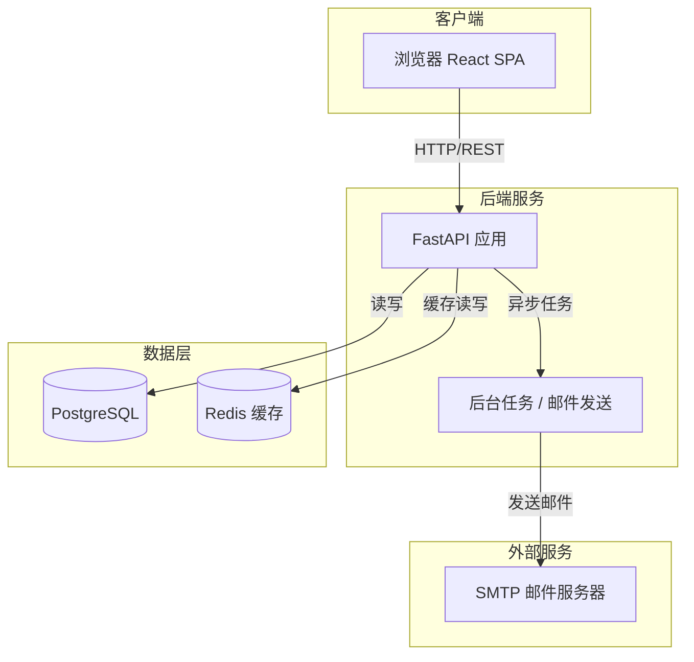
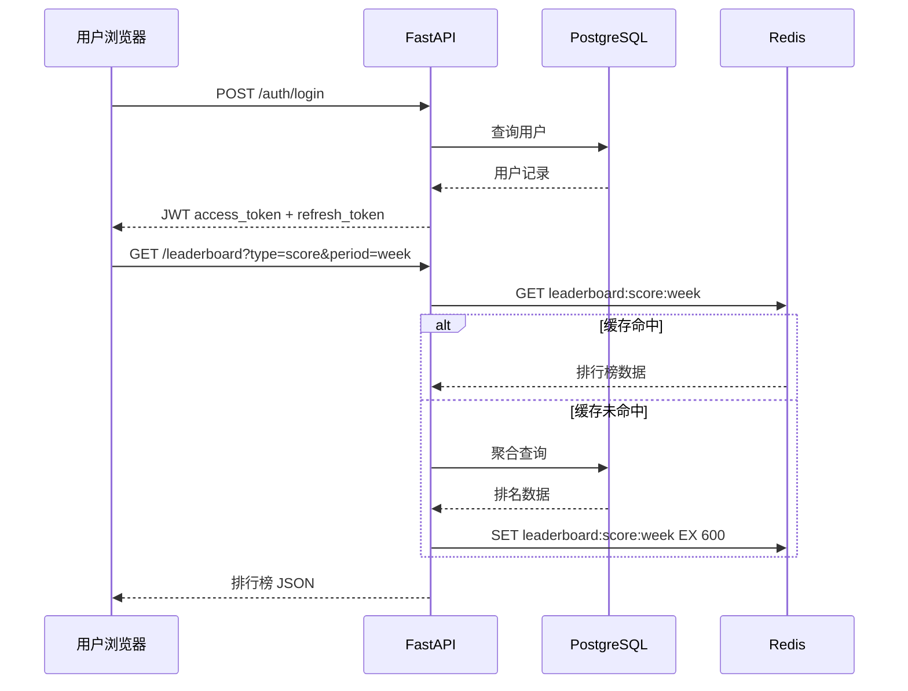
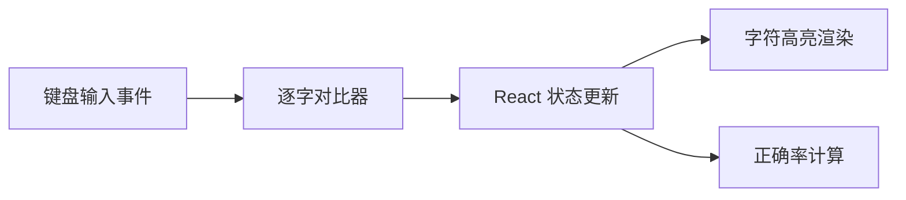
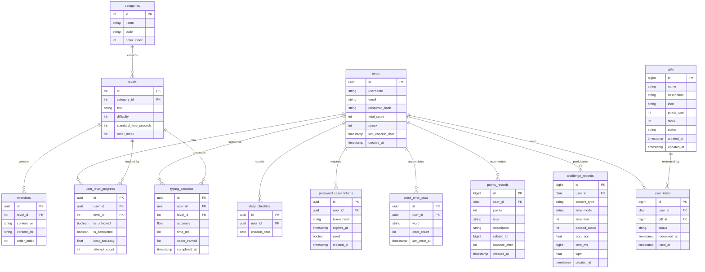

# 技术设计文档：英语学习打字网站

## 概述

本项目是一个基于 Web 的英语学习打字平台，参考"金山打字通"的交互模式。用户通过逐字打字练习英语单词、短语和句子，系统实时检测输入正确性并以颜色高亮反馈。平台采用闯关制学习路径，配合每日打卡、积分系统和排行榜，激励用户持续学习。

### 技术选型

| 层次 | 技术 |
|------|------|
| 前端框架 | Vue 3 + TypeScript |
| 前端状态管理 | Pinia |
| 前端路由 | Vue Router v4 |
| UI 组件库 | Tailwind CSS（响应式断点适配移动端） |
| 后端框架 | Spring Boot 3.x (Java 17+) |
| 数据库 | MySQL 8.0 |
| ORM | Spring Data JPA + Hibernate |
| 缓存 | Redis 7 + Spring Data Redis |
| 邮件发送 | Spring Boot Mail (JavaMailSender) + `application.yml` 配置 |
| 认证 | Spring Security + JWT (access token 2h + refresh token 7d) + jjwt |
| 构建工具 | Maven |
| 容器化 | Docker + Docker Compose |

### 设计目标

- 打字检测响应延迟 ≤ 50ms（纯前端本地计算，无需网络请求）
- 排行榜数据缓存于 Redis，每 10 分钟刷新一次
- 密码重置令牌有效期 30 分钟，同一邮箱 10 分钟内限发 3 封
- 所有 SMTP 配置从配置文件读取，不硬编码
- 全端响应式支持：桌面、平板、手机浏览器均可正常使用，打字练习支持物理键盘（含蓝牙键盘）和手机软键盘输入

### 响应式断点规范

使用 Tailwind CSS 默认断点：

| 断点 | 宽度 | 适配场景 |
|------|------|---------|
| 默认（无前缀） | < 768px | 手机竖屏 |
| `md:` | ≥ 768px | 平板 / 手机横屏 |
| `lg:` | ≥ 1024px | 桌面 |

关键页面适配策略：
- 打字练习页：手机端字体适当缩小，字符显示区域单行滚动；桌面端多行展示
- 关卡列表：手机单列，桌面双列或三列网格
- 排行榜：手机隐藏次要列，只保留排名、用户名、分数
- 导航栏：手机端折叠为汉堡菜单

---

## 架构

### 整体架构图



### 请求流程



### 打字检测架构（纯前端）

打字检测完全在浏览器端完成，不发送任何网络请求，保证 ≤ 50ms 响应：



---

## 组件与接口

### 前端组件树

```
App
├── AuthLayout
│   ├── LoginPage
│   ├── RegisterPage
│   └── ResetPasswordPage
├── MainLayout (需登录)
│   ├── HomePage (打卡日历 + 统计概览)
│   ├── LevelListPage (关卡列表)
│   ├── LevelDetailPage (关卡详情 + 预览)
│   ├── TypingPage (打字练习核心页)
│   ├── LeaderboardPage (排行榜)
│   └── ProfilePage (个人数据统计)
```

### 核心前端组件

#### TypingEngine（打字引擎）

```typescript
interface TypingEngineProps {
  target: string;          // 目标字符串
  onComplete: (result: TypingResult) => void;
}

interface TypingResult {
  accuracy: number;        // 0-100
  timeMs: number;          // 用时毫秒
  errorChars: string[];    // 输入错误的字符列表
}
```

逐字对比逻辑在 `keydown` 事件处理器中同步执行，状态更新通过 `useReducer` 批量处理，确保渲染延迟 ≤ 50ms。

#### CharDisplay（字符高亮显示）

```typescript
type CharState = 'pending' | 'correct' | 'incorrect' | 'current';

interface CharDisplayProps {
  chars: Array<{ char: string; state: CharState }>;
}
```

### 后端 API 接口

#### 认证模块 `/auth`

| 方法 | 路径 | 描述 |
|------|------|------|
| POST | `/auth/register` | 用户注册 |
| POST | `/auth/login` | 用户登录 |
| POST | `/auth/refresh` | 刷新 access token |
| POST | `/auth/logout` | 退出登录 |
| POST | `/auth/forgot-password` | 申请密码重置 |
| POST | `/auth/reset-password` | 提交新密码 |

#### 关卡模块 `/levels`

| 方法 | 路径 | 描述 |
|------|------|------|
| GET | `/levels` | 获取关卡列表（含解锁状态） |
| GET | `/levels/{id}` | 获取关卡详情及练习内容 |
| POST | `/levels/{id}/complete` | 提交关卡完成结果 |

#### 打卡模块 `/checkin`

| 方法 | 路径 | 描述 |
|------|------|------|
| GET | `/checkin/calendar` | 获取过去 30 天打卡记录 |
| GET | `/checkin/streak` | 获取当前连续打卡天数 |

#### 排行榜模块 `/leaderboard`

| 方法 | 路径 | 描述 |
|------|------|------|
| GET | `/leaderboard` | 获取排行榜（参数：type, period） |

#### 统计模块 `/stats`

| 方法 | 路径 | 描述 |
|------|------|------|
| GET | `/stats/me` | 获取个人统计数据 |
| GET | `/stats/weak-words` | 获取易错词汇 Top 10 |

#### 积分记录模块 `/points`

| 方法 | 路径 | 描述 | 权限 |
|------|------|------|------|
| GET | `/points/records` | 获取当前用户积分记录（分页，支持按类型筛选） | USER |
| GET | `/admin/points/records` | 获取所有用户积分记录（分页，支持按用户名、用户ID、类型、时间范围筛选） | ADMIN |

**管理员查询参数**：
- `userId`：按用户 ID 查询（可选）
- `username`：按用户名搜索（可选）
- `type`：按积分类型筛选（LEVEL_COMPLETE/CHALLENGE/CHECKIN_BONUS/GIFT_EXCHANGE 等，可选）
- `startDate`：开始日期（可选）
- `endDate`：结束日期（可选）

---

## 数据模型

### 数据库 ER 图



### 关键数据模型说明

**users**
- `total_score`：累计总积分，每次完成关卡后原子更新
- `streak`：连续打卡天数，每日由定时任务检查并重置
- `last_checkin_date`：最后打卡日期，用于判断连续性

**password_reset_tokens**
- `token_hash`：存储令牌的 SHA-256 哈希值，原始令牌仅在邮件中出现
- `used`：令牌使用后立即标记为 true，防止重放攻击
- 限流逻辑：查询同一 `user_id` 在过去 10 分钟内 `created_at` 的记录数

**word_error_stats**
- 每次打字会话结束后，批量 upsert 错误字符对应的单词
- 按 `error_count DESC` 取前 10 条作为易错词汇

**points_records**
- 记录所有积分变动明细，支持积分获得和消耗的历史追溯
- `points`：正数表示获得积分，负数表示消耗积分
- `type`：变动类型（LEVEL_COMPLETE/CHALLENGE/CHECKIN_BONUS/GIFT_EXCHANGE/ADMIN_GRANT/ACTIVITY_BONUS）
- `related_id`：关联业务 ID（关卡 ID/挑战记录 ID/道具 ID 等），用于追溯来源
- `balance_after`：变动后的积分余额，方便对账和审计

**gifts**
- 虚拟道具商城的商品表，所有道具均为虚拟商品（如改名卡）
- `points_cost`：兑换所需积分
- `stock`：库存数量，为 0 时不可兑换
- `status`：道具状态（ON_SHELF 上架/OFF_SHELF 下架）
- 兑换流程：验证积分和库存 → 扣除积分 → 扣减库存 → 记录积分变动 → 添加至用户背包 → 立即生效或待使用
- 无需发货流程，兑换即完成

### Redis 缓存键设计

| 键 | 类型 | TTL | 说明 |
|----|------|-----|------|
| `leaderboard:score:week` | String (JSON) | 600s | 本周积分榜（全部） |
| `leaderboard:score:week:{category}` | String (JSON) | 600s | 本周积分榜（按分类） |
| `leaderboard:score:all` | String (JSON) | 600s | 总积分榜（全部） |
| `leaderboard:score:all:{category}` | String (JSON) | 600s | 总积分榜（按分类） |
| `leaderboard:streak:week` | String (JSON) | 600s | 本周打卡榜（全部） |
| `leaderboard:streak:all` | String (JSON) | 600s | 总打卡榜（全部） |
| `reset_email_count:{user_id}` | String (int) | 600s | 10 分钟内发送次数 |


---

## 正确性属性

*属性（Property）是在系统所有合法执行中都应成立的特征或行为——本质上是对系统应该做什么的形式化陈述。属性是人类可读规范与机器可验证正确性保证之间的桥梁。*

### 属性 1：邮箱格式验证的普遍性

*对于任意字符串*，只有符合 RFC 5322 格式的邮箱才能通过邮箱格式验证，不符合格式的字符串应被拒绝。

**验证：需求 1.2**

---

### 属性 2：密码长度验证的普遍性

*对于任意长度为 0 到 7 的字符串*，将其作为密码提交注册时，系统应拒绝并返回密码长度不足的提示；*对于任意长度 ≥ 8 的字符串*，系统应接受该密码（在其他条件合法的前提下）。

**验证：需求 1.5**

---

### 属性 3：练习内容预览包含双语信息

*对于任意练习内容列表*，调用预览渲染函数后，每条练习内容的渲染结果都应同时包含英文原文和中文释义。

**验证：需求 2.2**

---

### 属性 4：打字对比逻辑正确性

*对于任意目标字符串和任意已输入字符序列*，逐字对比函数应将每个位置的字符状态正确标记为 `correct`（输入与目标一致）或 `incorrect`（输入与目标不一致），且正确率计算结果应等于 `correct 字符数 / 总输入字符数 × 100`。

**验证：需求 3.1、3.2、3.3**

---

### 属性 5：退格操作正确回退状态

*对于任意输入序列*，在任意位置插入退格操作后，已输入字符列表的长度应减少 1（若列表非空），且最后一个字符被移除，系统状态与未输入该字符时一致。

**验证：需求 3.5**

---

### 属性 6：关卡解锁与正确率的关系

*对于任意关卡和任意完成结果*，当正确率 ≥ 80% 时，下一关卡应被解锁；当正确率 < 80% 时，下一关卡不应被解锁，且当前关卡状态保持不变。

**验证：需求 4.3、4.4**

---

### 属性 7：关卡状态渲染的完整性

*对于任意关卡状态列表*（已解锁/已完成/未解锁），渲染函数应为每个关卡输出与其状态对应的视觉标识，三种状态的标识应互不相同。

**验证：需求 4.5**

---

### 属性 8：打卡记录创建的正确性

*对于任意用户在任意自然日首次完成关卡的事件*，系统应创建一条打卡记录，且记录的日期与事件发生的自然日一致；同一用户同一自然日的第二次完成不应创建重复记录。

**验证：需求 5.1**

---

### 属性 9：Streak 计算规则

*对于任意用户的打卡历史*，若连续打卡天数为 7 的整数倍（且 > 0），系统应发放额外积分奖励；若某一自然日无打卡记录，则该用户的 streak 应重置为 0。

**验证：需求 5.3、5.4**

---

### 属性 10：积分计算公式正确性

*对于任意正确率（0-100）、任意用时和任意关卡标准时间*，积分计算函数的返回值应严格等于：`100 + max(0, accuracy - 80) × 2 + max(0, floor((standard_time - actual_time) / 10)) × 5`。

**验证：需求 6.1、6.2**

---

### 属性 11：打卡积分奖励的固定性

*对于任意用户完成每日打卡的事件*，系统应将该用户的总积分增加恰好 50 分，不多不少。

**验证：需求 6.3**

---

### 属性 12：排行榜渲染包含必要字段

*对于任意用户数据列表*，排行榜渲染函数的输出中，每条记录都应包含用户名、头像、积分（或 streak）字段，且总条数不超过 100。

**验证：需求 7.2**

---

### 属性 13：当前用户排名高亮的正确性

*对于任意排行榜数据和任意当前登录用户*，渲染结果中该用户对应的条目应被标记为高亮状态，且其他用户的条目不应被标记为高亮。

**验证：需求 7.3**

---

### 属性 14：历史最高正确率的单调性

*对于任意用户在某关卡的多次练习记录*，`best_accuracy` 字段的值应始终等于所有历史记录中正确率的最大值，且随着新记录的加入只能增大或保持不变，不能减小。

**验证：需求 8.2、8.3**

---

### 属性 15：易错词汇 Top-10 排序正确性

*对于任意包含超过 10 个单词的错误统计数据*，`get_weak_words` 函数应返回恰好 10 个单词，且这 10 个单词的错误次数均不小于未返回的任何单词的错误次数，结果按错误次数降序排列。

**验证：需求 8.4**

---

### 属性 16：重置令牌的唯一性

*对于任意数量的令牌生成请求*，每次生成的原始令牌值应互不相同（碰撞概率可忽略不计），且每个令牌的过期时间应为生成时刻加 30 分钟。

**验证：需求 9.4**

---

### 属性 17：令牌验证逻辑的正确性

*对于任意令牌状态*（有效/已过期/已使用/不存在），令牌验证函数应对有效令牌返回通过，对其他所有状态返回失败，且失败时不应修改任何数据库状态。

**验证：需求 9.7、9.8**

---

### 属性 18：令牌使用后立即失效

*对于任意有效令牌*，成功完成密码重置后，该令牌的 `used` 字段应被标记为 `true`，且再次使用同一令牌时验证函数应返回失败。

**验证：需求 9.11**

---

### 属性 19：密码重置限流规则

*对于任意邮箱*，在任意 10 分钟窗口内，前 3 次重置请求应被正常处理，第 4 次及之后的请求应被拒绝并返回频率限制提示。

**验证：需求 9.12**

---

### 属性 20：新密码验证规则

*对于任意两个密码字符串的组合*，若两者不一致或任意一个长度 < 8，密码重置表单应拒绝提交；只有两者一致且长度均 ≥ 8 时才允许提交。

**验证：需求 9.10**

---

## 错误处理

### 认证错误

| 场景 | HTTP 状态码 | 响应体 |
|------|------------|--------|
| 邮箱格式非法 | 422 | `{"detail": "邮箱格式不合法"}` |
| 邮箱已注册 | 409 | `{"detail": "该邮箱已被注册"}` |
| 密码不足 8 位 | 422 | `{"detail": "密码至少需要 8 个字符"}` |
| 邮箱或密码错误 | 401 | `{"detail": "邮箱或密码错误"}` |
| Token 过期 | 401 | `{"detail": "登录已过期，请重新登录"}` |

### 密码重置错误

| 场景 | HTTP 状态码 | 响应体 |
|------|------------|--------|
| 邮箱未注册 | 404 | `{"detail": "该邮箱未注册"}` |
| 发送过于频繁 | 429 | `{"detail": "发送过于频繁，请稍后再试"}` |
| 令牌无效或过期 | 400 | `{"detail": "链接已失效，请重新申请"}` |
| 两次密码不一致 | 422 | `{"detail": "两次输入的密码不一致"}` |

### 关卡错误

| 场景 | HTTP 状态码 | 响应体 |
|------|------------|--------|
| 关卡不存在 | 404 | `{"detail": "关卡不存在"}` |
| 关卡未解锁 | 403 | `{"detail": "该关卡尚未解锁"}` |

### 全局错误处理

- 所有未捕获异常返回 500，日志记录完整堆栈
- 数据库连接失败时返回 503，不暴露内部错误信息
- 请求体解析失败返回 422，附带字段级错误详情

---

## 测试策略

### 测试分层

```
单元测试（Unit Tests）
├── 纯函数逻辑（打字对比、积分计算、令牌验证等）
├── 数据验证逻辑（邮箱格式、密码强度）
└── 排序/过滤逻辑（易错词汇、排行榜）

属性测试（Property-Based Tests）
├── 覆盖上述所有 20 个正确性属性
└── 使用 jqwik（Java）和 fast-check（TypeScript）

集成测试（Integration Tests）
├── API 端点测试（使用 Spring Boot Test + MockMvc）
├── 数据库操作测试（使用 @DataJpaTest + H2 内存库）
└── SMTP 邮件发送测试（GreenMail Mock SMTP 服务器）

端到端测试（E2E Tests）
└── 核心用户流程（注册→登录→打字练习→完成关卡）
    使用 Playwright
```

### 属性测试配置

**后端（Java + jqwik）**

```java
import net.jqwik.api.*;

@Property(tries = 200)
void scoreCalculationProperty(
    @ForAll @DoubleRange(min = 0, max = 100) double accuracy,
    @ForAll @IntRange(min = 0, max = 3600) int actualTime,
    @ForAll @IntRange(min = 30, max = 600) int standardTime
) {
    // Feature: english-typing-learning, Property 10: 积分计算公式正确性
    int score = ScoreCalculator.calculate(accuracy, actualTime, standardTime);
    int expected = 100
        + (int) Math.max(0, (accuracy - 80)) * 2
        + Math.max(0, (standardTime - actualTime) / 10) * 5;
    assertThat(score).isEqualTo(expected);
}
```

**前端（TypeScript + fast-check）**

```typescript
import * as fc from 'fast-check'
import { compareTyping } from '@/utils/typing'

test('Property 4: 打字对比逻辑正确性', () => {
  // Feature: english-typing-learning, Property 4: 打字对比逻辑正确性
  fc.assert(
    fc.property(
      fc.string({ minLength: 1 }),
      fc.string(),
      (target, input) => {
        const result = compareTyping(target, input)
        // 验证每个字符状态正确
      }
    ),
    { numRuns: 200 }
  )
})

每个属性测试最少运行 **200 次迭代**，每个测试用例通过注释标注对应的设计属性编号，格式为：`Feature: english-typing-learning, Property {N}: {属性标题}`。

### 单元测试重点

- 积分计算函数的边界值（正确率恰好 80%、用时恰好等于标准时间）
- 令牌过期判断的时间边界
- Streak 重置逻辑（跨自然日判断）
- 易错词汇排序（相同错误次数时的稳定性）

### 集成测试重点

- 完整的注册→登录→获取 JWT 流程（MockMvc + @SpringBootTest）
- 密码重置完整流程（GreenMail 模拟 SMTP 收件验证）
- 关卡完成后积分和解锁状态的原子更新（@Transactional 测试）
- 排行榜缓存命中与未命中的两条路径（EmbeddedRedis）

### 打字引擎性能测试

验证在 1000 字符的目标字符串下，`compareTyping` 函数的执行时间 < 5ms（远低于 50ms 要求，为 Vue 响应式渲染留出余量）。

---

## 练习内容数据来源

### 数据资源总览

| 资源 | 类型 | 协议 | 适用分类 | 地址 |
|------|------|------|---------|------|
| ECDICT | 词汇（含释义、词频、考纲标注） | MIT | 全部 | https://github.com/skywind3000/ECDICT |
| mahavivo/english-wordlists | 各考纲词汇表（TXT/CSV） | 公开 | 初中/高中/四六级 | https://github.com/mahavivo/english-wordlists |
| Tatoeba | 中英对照例句 | CC BY 2.0 | 全部 | https://tatoeba.org/zh-cn/downloads |
| Project Gutenberg | 公版英文书籍 | 公有领域 | 高级阅读练习 | https://www.gutenberg.org/ |

---

### ECDICT 使用方法（主要词库）

ECDICT 是最推荐的词汇来源，提供 SQLite 和 CSV 两种格式，字段完整，含考纲标注。

**1. 下载数据**

```bash
# 下载 CSV 版本（约 18MB）
wget https://github.com/skywind3000/ECDICT/raw/master/ecdict.csv
```

**2. 关键字段说明**

| 字段 | 说明 |
|------|------|
| `word` | 英文单词 |
| `phonetic` | 音标 |
| `definition` | 英文释义 |
| `translation` | 中文释义（`\n` 分隔多个释义） |
| `pos` | 词性（n./v./adj. 等） |
| `tag` | 考纲标注，多个用空格分隔 |
| `bnc` | BNC 语料库词频 |
| `frq` | 当代语料库词频，数值越大越常见 |
| `exchange` | 词形变化（复数、过去式等） |

`tag` 字段常见值：
- `zk` = 中考（初中）
- `gk` = 高考（高中）
- `cet4` = 四级
- `cet6` = 六级
- `ielts` = 雅思
- `toefl` = 托福

小学词汇可用 `frq` 词频过滤（frq 较大的高频词，建议取 frq > 5000）。

**3. 导入 MySQL**

```sql
-- 创建临时导入表（完整字段）
CREATE TABLE ecdict_import (
    word        VARCHAR(64),
    phonetic    VARCHAR(128),
    definition  TEXT,
    translation TEXT,
    pos         VARCHAR(32),
    collins     VARCHAR(8),
    oxford      VARCHAR(8),
    tag         VARCHAR(256),
    bnc         INT,
    frq         INT,
    exchange    VARCHAR(256),
    detail      TEXT,
    audio       VARCHAR(256)
) CHARACTER SET utf8mb4;

-- 用 LOAD DATA 导入 CSV（需开启 local_infile）
LOAD DATA LOCAL INFILE 'ecdict.csv'
INTO TABLE ecdict_import
CHARACTER SET utf8mb4
FIELDS TERMINATED BY ','
ENCLOSED BY '"'
LINES TERMINATED BY '\n'
IGNORE 1 ROWS;
```

**4. 按分类筛选并写入 exercises 表**

```sql
-- 四级词汇示例
INSERT INTO exercises (level_id, content_en, content_zh, order_index)
SELECT
    1,
    word,
    SUBSTRING_INDEX(translation, '\\n', 1),  -- 取第一条中文释义
    (@row := @row + 1)
FROM ecdict_import, (SELECT @row := 0) r
WHERE tag LIKE '%cet4%'
  AND frq > 0
  AND translation IS NOT NULL
  AND translation != ''
ORDER BY frq DESC
LIMIT 20;  -- 每关卡 20 个词

-- 各分类对应的过滤条件：
-- 小学：frq > 5000（超高频基础词）
-- 初中：tag LIKE '%zk%'
-- 高中：tag LIKE '%gk%'
-- 四级：tag LIKE '%cet4%'
-- 六级：tag LIKE '%cet6%'
```

---

### Tatoeba 例句使用方法（短句来源）

**1. 下载数据**

前往 https://tatoeba.org/zh-cn/downloads 下载：
- `sentences.csv`：所有句子（含语言标注）
- `links.csv`：句子翻译对应关系

**2. 提取中英对照句子**

```python
# 用 Python 脚本提取中英对照句子
import pandas as pd

sentences = pd.read_csv('sentences.csv', sep='\t',
                        names=['id', 'lang', 'text'])
links = pd.read_csv('links.csv', sep='\t',
                    names=['sentence_id', 'translation_id'])

en = sentences[sentences['lang'] == 'eng']
zh = sentences[sentences['lang'] == 'cmn']

# 通过 links 关联中英句子
pairs = links.merge(en, left_on='sentence_id', right_on='id')
pairs = pairs.merge(zh, left_on='translation_id', right_on='id',
                    suffixes=('_en', '_zh'))

result = pairs[['text_en', 'text_zh']]
result.to_csv('en_zh_pairs.csv', index=False)
```

**3. 按难度过滤**

可以用句子长度和词汇难度粗略过滤：
- 初级：句子长度 ≤ 8 词，词汇在初中词库内
- 中级：句子长度 8-15 词
- 高级：句子长度 > 15 词

---

### 数据初始化建议

项目初期推荐按以下顺序准备数据：

1. 先用 ECDICT 准备五个分类的词汇，每个分类 10 个关卡，每关 20 个词
2. 用 Tatoeba 为每个分类补充 5 个短句关卡
3. 上线后根据用户反馈逐步增加关卡数量

初始数据量参考：

| 分类 | 词汇关卡数 | 短句关卡数 | 总词汇量 |
|------|-----------|-----------|---------|
| 小学 | 10 | 5 | ~200词 |
| 初中 | 15 | 5 | ~300词 |
| 高中 | 20 | 10 | ~400词 |
| 四级 | 25 | 10 | ~500词 |
| 六级 | 25 | 10 | ~500词 |

数据初始化脚本建议放在 `src/main/resources/db/seed/` 目录下，通过 Flyway 或手动执行导入。


---

## 管理员系统设计

### 管理员角色与权限

#### 用户角色枚举

```java
public enum UserRole {
    USER,   // 普通用户
    ADMIN   // 管理员
}
```

#### 权限控制策略

- 使用 Spring Security 的 `@PreAuthorize` 注解进行方法级权限控制
- JWT 令牌中包含用户角色信息
- 所有管理接口路径前缀为 `/admin`，统一拦截验证管理员权限

### 管理员 API 接口

#### 用户管理模块 `/admin/users`

| 方法 | 路径 | 描述 | 权限 |
|------|------|------|------|
| GET | `/admin/users` | 获取用户列表（分页） | ADMIN |
| GET | `/admin/users/{id}` | 获取用户详情 | ADMIN |
| PUT | `/admin/users/{id}/ban` | 封禁用户 | ADMIN |
| PUT | `/admin/users/{id}/unban` | 解封用户 | ADMIN |
| DELETE | `/admin/users/{id}` | 删除用户 | ADMIN |
| POST | `/admin/users/{id}/reset-password` | 重置用户密码 | ADMIN |
| PUT | `/admin/users/{id}/role` | 修改用户角色 | ADMIN |

**用户列表查询参数**：
- `page`：页码（从 0 开始）
- `size`：每页数量（默认 20）
- `keyword`：搜索关键词（用户名或邮箱）
- `role`：角色筛选（USER/ADMIN）
- `status`：状态筛选（ACTIVE/BANNED）

#### 分类管理模块 `/admin/categories`

| 方法 | 路径 | 描述 | 权限 |
|------|------|------|------|
| GET | `/admin/categories` | 获取所有分类 | ADMIN |
| GET | `/admin/categories/{id}` | 获取分类详情 | ADMIN |
| POST | `/admin/categories` | 创建新分类 | ADMIN |
| PUT | `/admin/categories/{id}` | 更新分类信息 | ADMIN |
| DELETE | `/admin/categories/{id}` | 删除分类 | ADMIN |

**创建/更新分类请求体**：
```json
{
  "name": "小学",
  "description": "适合小学生的基础词汇",
  "difficulty": 1
}
```

#### 关卡管理模块 `/admin/levels`

| 方法 | 路径 | 描述 | 权限 |
|------|------|------|------|
| GET | `/admin/levels` | 获取所有关卡（可按分类筛选） | ADMIN |
| GET | `/admin/levels/{id}` | 获取关卡详情 | ADMIN |
| POST | `/admin/levels` | 创建新关卡 | ADMIN |
| PUT | `/admin/levels/{id}` | 更新关卡信息 | ADMIN |
| DELETE | `/admin/levels/{id}` | 删除关卡 | ADMIN |

**创建/更新关卡请求体**：
```json
{
  "categoryId": 1,
  "name": "第1关：基础单词",
  "description": "学习最基础的英语单词",
  "levelOrder": 1,
  "standardTimeMs": 60000
}
```

#### 练习内容管理模块 `/admin/exercises`

| 方法 | 路径 | 描述 | 权限 |
|------|------|------|------|
| GET | `/admin/exercises` | 获取练习内容列表（按关卡筛选） | ADMIN |
| GET | `/admin/exercises/{id}` | 获取练习内容详情 | ADMIN |
| POST | `/admin/exercises` | 创建新练习内容 | ADMIN |
| POST | `/admin/exercises/batch` | 批量创建练习内容 | ADMIN |
| PUT | `/admin/exercises/{id}` | 更新练习内容 | ADMIN |
| DELETE | `/admin/exercises/{id}` | 删除练习内容 | ADMIN |

**创建/更新练习内容请求体**：
```json
{
  "levelId": 1,
  "contentEn": "hello",
  "contentZh": "你好",
  "exerciseOrder": 1
}
```

**批量创建请求体**：
```json
{
  "levelId": 1,
  "exercises": [
    {
      "contentEn": "hello",
      "contentZh": "你好",
      "exerciseOrder": 1
    },
    {
      "contentEn": "world",
      "contentZh": "世界",
      "exerciseOrder": 2
    }
  ]
}
```

#### 操作日志模块 `/admin/logs`

| 方法 | 路径 | 描述 | 权限 |
|------|------|------|------|
| GET | `/admin/logs` | 获取操作日志（分页） | ADMIN |

**操作日志查询参数**：
- `page`：页码
- `size`：每页数量
- `operatorId`：操作人 ID
- `operationType`：操作类型（CREATE/UPDATE/DELETE）
- `targetType`：操作对象类型（USER/CATEGORY/LEVEL/EXERCISE）
- `startDate`：开始日期
- `endDate`：结束日期

### 数据模型扩展

#### User 表扩展

```sql
ALTER TABLE users ADD COLUMN role VARCHAR(20) NOT NULL DEFAULT 'USER' COMMENT '用户角色（USER/ADMIN）';
ALTER TABLE users ADD COLUMN status VARCHAR(20) NOT NULL DEFAULT 'ACTIVE' COMMENT '账号状态（ACTIVE/BANNED）';
ALTER TABLE users ADD COLUMN banned_at DATETIME NULL COMMENT '封禁时间';
ALTER TABLE users ADD COLUMN banned_reason VARCHAR(500) NULL COMMENT '封禁原因';

CREATE INDEX idx_users_role ON users(role);
CREATE INDEX idx_users_status ON users(status);
```

#### 新增操作日志表

```sql
CREATE TABLE admin_operation_logs (
  id INT NOT NULL AUTO_INCREMENT COMMENT '日志 ID',
  operator_id CHAR(36) NOT NULL COMMENT '操作人 ID',
  operator_name VARCHAR(50) NOT NULL COMMENT '操作人用户名',
  operation_type VARCHAR(20) NOT NULL COMMENT '操作类型（CREATE/UPDATE/DELETE）',
  target_type VARCHAR(20) NOT NULL COMMENT '操作对象类型（USER/CATEGORY/LEVEL/EXERCISE）',
  target_id VARCHAR(50) NOT NULL COMMENT '操作对象 ID',
  operation_detail TEXT NULL COMMENT '操作详情（JSON）',
  ip_address VARCHAR(50) NULL COMMENT '操作 IP',
  created_at DATETIME NOT NULL DEFAULT CURRENT_TIMESTAMP COMMENT '操作时间',
  PRIMARY KEY (id),
  KEY idx_operator_id (operator_id),
  KEY idx_operation_type (operation_type),
  KEY idx_target_type (target_type),
  KEY idx_created_at (created_at),
  CONSTRAINT fk_aol_operator FOREIGN KEY (operator_id) REFERENCES users (id) ON DELETE CASCADE
) ENGINE=InnoDB DEFAULT CHARSET=utf8mb4 COMMENT='管理员操作日志表';
```

### 管理员初始化

#### 超级管理员账号

系统启动时自动创建超级管理员账号（如果不存在）：

```java
@Component
public class AdminInitializer implements ApplicationRunner {
    
    @Override
    public void run(ApplicationArguments args) {
        // 检查是否存在管理员账号
        if (!userRepository.existsByRole(UserRole.ADMIN)) {
            // 创建超级管理员
            User admin = User.builder()
                .id(UUID.randomUUID().toString())
                .username("admin")
                .email("admin@example.com")
                .passwordHash(passwordEncoder.encode("Admin@123456"))
                .role(UserRole.ADMIN)
                .status(UserStatus.ACTIVE)
                .build();
            userRepository.save(admin);
            log.info("超级管理员账号已创建：admin / Admin@123456");
        }
    }
}
```

**默认超级管理员账号**：
- 用户名：`admin`
- 邮箱：`admin@example.com`
- 密码：`Admin@123456`（首次登录后建议修改）

### 权限验证实现

#### JWT 令牌包含角色信息

```java
public String generateAccessToken(User user) {
    return Jwts.builder()
        .setSubject(user.getId())
        .claim("username", user.getUsername())
        .claim("role", user.getRole().name())  // 添加角色信息
        .setIssuedAt(new Date())
        .setExpiration(new Date(System.currentTimeMillis() + accessTokenExpiration))
        .signWith(getSigningKey(), SignatureAlgorithm.HS256)
        .compact();
}
```

#### 权限注解使用

```java
@RestController
@RequestMapping("/admin/users")
@PreAuthorize("hasRole('ADMIN')")  // 类级别权限控制
public class AdminUserController {
    
    @GetMapping
    public ResponseEntity<Page<UserDto>> getUsers(
        @RequestParam(defaultValue = "0") int page,
        @RequestParam(defaultValue = "20") int size) {
        // 只有管理员可以访问
    }
}
```

### 操作日志记录

使用 AOP 切面自动记录所有管理操作：

```java
@Aspect
@Component
public class AdminOperationLogAspect {
    
    @Around("@annotation(AdminOperation)")
    public Object logOperation(ProceedingJoinPoint joinPoint) throws Throwable {
        // 记录操作前状态
        // 执行操作
        Object result = joinPoint.proceed();
        // 记录操作日志
        saveOperationLog(joinPoint, result);
        return result;
    }
}
```

### 安全考虑

1. **防止权限提升**：普通用户不能将自己提升为管理员
2. **超级管理员保护**：超级管理员账号不能被删除或降级
3. **操作审计**：所有管理操作都记录日志，包括 IP 地址
4. **二次确认**：删除操作需要前端二次确认
5. **批量操作限制**：批量删除/封禁操作限制数量（如一次最多 100 个）

---

## 指法训练模块设计

### 功能概述

参考 typinglearner.com/finger-typing 的交互模式，实现渐进式指法训练：从食指基准键（F、J）开始，逐步解锁全键盘，通过置信度算法自动生成针对性练习序列。

### 前端组件设计

#### 页面路由
- 路径：`/finger-typing`
- 组件：`front/src/views/FingerTypingView.vue`
- 布局：`main`（需要登录）

#### 核心组件

**1. `KeyboardDisplay.vue` - 可视化键盘**
- 渲染标准 QWERTY 键盘布局（3行字母键 + 空格键）
- 每个键根据状态显示不同颜色：
  - 🟢 绿色：已达标（置信度 ≥ 90%）
  - 🟡 黄色：接近达标（置信度 60-89%）
  - 🔴 红色：需要练习（置信度 < 60%，已解锁）
  - ⚫ 灰色锁：未解锁
  - 🔵 蓝色高亮：当前待按键
- 显示手指分区颜色（左小指/无名指/中指/食指，右食指/中指/无名指/小指）

**2. `FingerTypingEngine.vue` - 练习引擎**
- 根据已解锁按键和置信度生成练习序列
- 算法：优先生成置信度低的按键，穿插已掌握按键巩固记忆
- 每次生成 20-30 个字符的练习序列
- 监听 `keydown` 事件，实时比对输入

**3. `TypingStats.vue` - 实时统计**
- WPM（每分钟单词数）= 正确字符数 / 5 / 已用分钟数
- 准确率 = 正确输入次数 / 总输入次数 × 100%
- 计时器（从第一次按键开始）

### 按键解锁顺序

| 阶段 | 解锁按键 | 说明 |
|------|---------|------|
| 1 | F, J | 食指基准键 |
| 2 | D, K | 中指基准键 |
| 3 | S, L | 无名指基准键 |
| 4 | A, ; | 小指基准键 |
| 5 | G, H | 食指延伸键 |
| 6 | E, I | 中指上排 |
| 7 | R, U | 食指上排 |
| 8 | W, O | 无名指上排 |
| 9 | Q, P | 小指上排 |
| 10 | T, Y | 食指上排延伸 |
| 11 | V, M | 食指下排 |
| 12 | C, , | 中指下排 |
| 13 | X, . | 无名指下排 |
| 14 | Z, / | 小指下排 |
| 15 | B, N | 食指下排延伸 |
| 16 | Space | 空格键（拇指） |

### 置信度算法

```
置信度(key) = min(100, 正确次数 / (正确次数 + 错误次数 * 2) * 100)
```

- 每次正确输入：+1 正确次数
- 每次错误输入：+1 错误次数（权重 ×2，错误惩罚更重）
- 解锁条件：所有已解锁按键置信度 ≥ 100%

### 数据持久化（localStorage）

```typescript
interface FingerTypingProgress {
  unlockedKeys: string[]        // 已解锁按键列表
  keyStats: Record<string, {    // 每个按键的统计
    correct: number
    incorrect: number
    confidence: number
  }>
  totalSessions: number         // 总练习次数
  lastPracticeAt: string        // 最后练习时间
}
```

### 页面布局

```
┌─────────────────────────────────────┐
│  指法训练    [重置本组] [重置全部]    │
├─────────────────────────────────────┤
│  练习序列：fjjfjfjfjfjfjfjfjfjfjfj   │
│  当前：F  下一个：J                  │
├─────────────────────────────────────┤
│         可视化键盘（热力图）          │
│  Q🔒 W🔒 E🔒 R🔒 T🔒 Y🔒 ...       │
│  A🔒 S🔒 D🔒 [F] G🔒 H🔒 [J] ...   │
│  Z🔒 X🔒 C🔒 V🔒 B🔒 N🔒 ...       │
├─────────────────────────────────────┤
│  速度: 0 WPM  准确率: 100%  时间: 0:00│
│  进度: 2/31 (6%)  已解锁: F J        │
└─────────────────────────────────────┘
```

### 响应式适配

- 桌面端：完整展示键盘 + 练习区 + 统计
- 移动端：显示提示"指法训练需要物理键盘，建议在电脑上使用"

---

## 天梯挑战模块设计

### 功能概述

天梯挑战是一种竞技性打字模式，从数据库随机抽取单词或短句，用户在限时或无限时模式下尽可能多地完成打字，结果提交排行榜与其他用户竞争。

### 数据库设计

#### 新增表：`challenge_records`（挑战记录）

```sql
CREATE TABLE challenge_records (
  id          BIGINT AUTO_INCREMENT PRIMARY KEY,
  user_id     CHAR(36) NOT NULL,
  content_type ENUM('WORD', 'SENTENCE') NOT NULL COMMENT '内容类型：单词/短句',
  time_mode   ENUM('TIMED', 'INFINITE') NOT NULL COMMENT '时间模式：限时/无限',
  time_limit  INT DEFAULT NULL COMMENT '限时模式的时长（秒），无限模式为NULL',
  passed_count INT NOT NULL DEFAULT 0 COMMENT '通过数量',
  accuracy    DOUBLE NOT NULL DEFAULT 0 COMMENT '正确率',
  time_ms     BIGINT DEFAULT NULL COMMENT '无限模式用时（毫秒）',
  wpm         INT NOT NULL DEFAULT 0 COMMENT '每分钟单词数',
  created_at  DATETIME NOT NULL DEFAULT CURRENT_TIMESTAMP,
  INDEX idx_user_id (user_id),
  INDEX idx_content_type_time_mode (content_type, time_mode),
  INDEX idx_passed_count (passed_count DESC)
) ENGINE=InnoDB DEFAULT CHARSET=utf8mb4 COMMENT='天梯挑战记录';
```

### 后端 API 设计

#### 1. 获取随机练习内容
```
GET /challenge/exercises?type={WORD|SENTENCE}&count=20
```
- `type=WORD`：从 exercises 表随机取单词（contentEn 长度 ≤ 20 字符）
- `type=SENTENCE`：从 exercises 表随机取短句（contentEn 长度 > 20 字符）
- 返回：`List<ChallengeExerciseDto>` { id, contentEn, contentZh }

#### 2. 提交挑战结果
```
POST /challenge/submit
Body: {
  contentType: "WORD" | "SENTENCE",
  timeMode: "TIMED" | "INFINITE",
  timeLimit: 60 | 120 | 300 | null,
  passedCount: number,
  accuracy: number,
  timeMs: number | null,
  wpm: number
}
```

#### 3. 获取天梯排行榜
```
GET /challenge/leaderboard?type={WORD|SENTENCE}&mode={TIMED|INFINITE}&timeLimit={60|120|300}
```
- 返回前 100 名 + 当前用户排名

#### 4. 获取历史记录
```
GET /challenge/history?page=0&size=10
```

### 前端组件设计

#### 页面路由
- 路径：`/challenge`
- 组件：`front/src/views/ChallengeView.vue`

#### 核心组件

**1. `ChallengeSetup.vue` - 挑战配置**
- 选择内容类型：单词 / 短句（Tab 切换）
- 选择时间模式：限时（60s/120s/300s）/ 无限
- "开始挑战"按钮

**2. `ChallengeGame.vue` - 游戏主界面**
- 顶部：倒计时（限时）/ 已用时（无限）+ 已通过数 + 正确率
- 中部：当前内容的中文提示 + 打字区域（复用 CharDisplay + TypingEngine）
- 底部：跳过按钮 + 停止按钮（无限模式）
- 预加载机制：剩余 5 条时自动请求下一批

**3. `ChallengeResult.vue` - 结果弹窗**
- 展示：通过数量、正确率、WPM、用时（无限模式）
- 按钮：查看排行榜 / 再来一次 / 返回

**4. `ChallengeLeaderboard.vue` - 天梯排行榜**
- Tab：单词榜 / 短句榜
- 子 Tab（限时榜）：60秒 / 120秒 / 300秒
- 子 Tab（无限榜）：按通过数排名
- 高亮当前用户

### 排名规则

| 模式 | 主排序 | 次排序 |
|------|--------|--------|
| 限时 | 通过数量 DESC | 正确率 DESC |
| 无限 | 通过数量 DESC | 用时 ASC |

### 内容筛选规则

- **单词**：`LENGTH(content_en) <= 20` 且不含空格（纯单词）
- **短句**：`LENGTH(content_en) > 20` 或含空格

### 页面布局

```
┌─────────────────────────────────────────┐
│  天梯挑战  [单词] [短句]                  │
│  时间模式：[60s] [120s] [300s] [无限]    │
│                                         │
│  ┌─────────────────────────────────┐    │
│  │  ⏱ 00:45  ✓ 12个  准确率 94%   │    │
│  ├─────────────────────────────────┤    │
│  │  中文：你好                      │    │
│  │  hello_                         │    │
│  │  [跳过]              [停止挑战]  │    │
│  └─────────────────────────────────┘    │
└─────────────────────────────────────────┘
```
